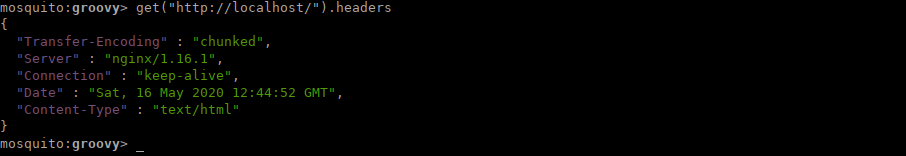

# Mosquito

An HTTP client wrapper designed for developers and other technically-oriented users, offering an interactive command-line interface (and others to come, such as a web and a REST API) with a code interpreter for processing user commands.

# Building

This is a simple maven project. To package an executable jar, make sure your `JAVA_HOME` variable points to an installation of JDK-11 or newer, then:

```
mvn clean package
```

# Running the CLI client

To run the CLI client, call `java` with the cli fat-jar artifact:

```
java -jar mosquito-client/mosquito-client-cli/target/mosquito-client-cli-[VERSION].jar
```

Where `[VERSION]` is the project version.

# How to use the mosquito-cli

When called without arguments, mosquito opens in interactive mode and expects `groovy` commands by default. The interpreter is a full-blown groovy shell that will process any command you give it. So use with care.

The shell exposes some methods that can be called with the infix or postfix syntax to make HTTP calls

```
mosquito:groovy> get('http://localhost/').headers
```

That makes an HTTP `GET` call to `https://www.google.com/`, stores the result in an object, and reads the HTTP response headers off it, returning it as a map.

One cool thing about mosquito-cli is that it prints its output in JSON for easy reading:

```
mosquito:groovy> get("http://localhost/").headers

{
  "Transfer-Encoding" : "chunked",
  "Server" : "nginx/1.16.1",
  "Connection" : "keep-alive",
  "Date" : "Sat, 16 May 2020 12:44:52 GMT",
  "Content-Type" : "text/html"
}
```

In the shell, though, there might be a little (to be refined) syntax highlighting:



As groovy supports infix syntax, one can achieve the same thing using:

```
mosquito:groovy> get 'http://localhost/' headers

```

# Documentation

The documentation will be indexed [here](docs/index.md)

# Status

These are still the days before version 1.0. When the initial feature set is implemented and successfully tested, some distribution packages will be built and made available under releases.

