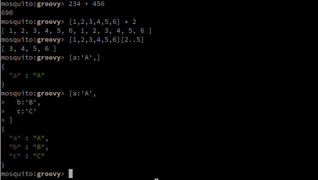
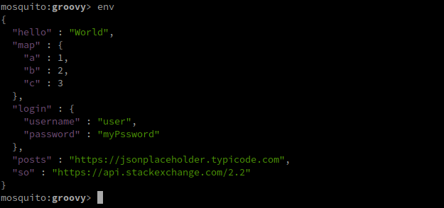
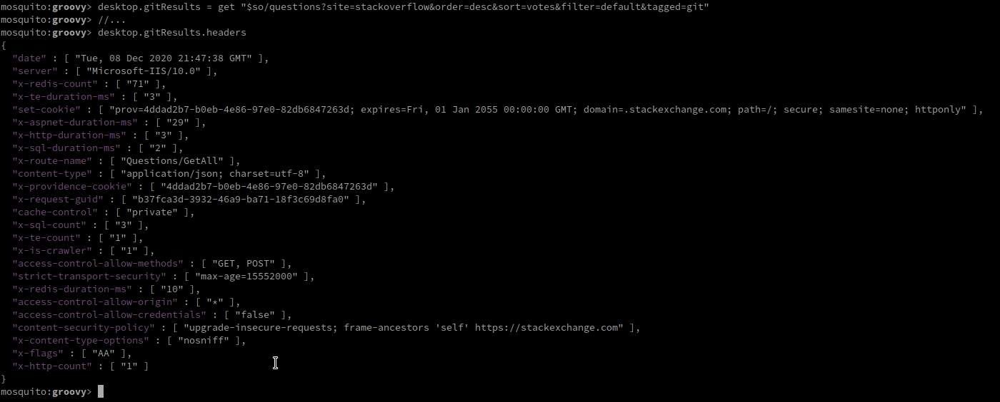
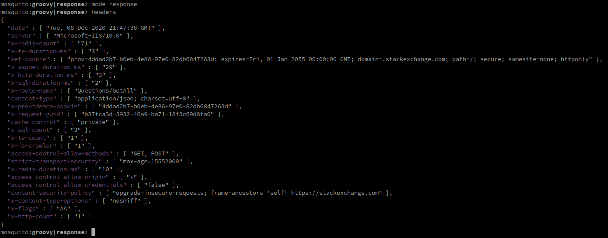

# Mosquito

An HTTP client wrapper designed for developers, test analysts, and other technically-oriented users, offering an interactive command-line interface (and others to come, such as a web and a REST API) with a code interpreter for processing user commands.

A Mosquito command line interface is pretty much a code interpreter. The API allows for multiple scripting languages to be used, although currently only Groovy is supported.

# Why Mosquito?

Mosquito is not meant to be a replacement for such great HTTP clients as Postman or curl. It's just designed to be a better fit for developers, offering an interface that allows more than just request/response mechanics. Mosquito is more inspired by HTTPie in its spirit of simplifying things for the developer/user, but it takes things a bit further by providing an environment that not only makes requests, but also supports processing responses programmatically.

# Building

This is a simple maven project. The artifact is built into a `jar` file. When it's ready for distribution, it will be built into a native image using either jlink or GraalVM; but this is to be sorted out.

## Maven build

To package an executable jar, make sure your `JAVA_HOME` variable points to an installation of JDK-11 or newer, then:

```
$ mvn clean package
```

The command-line jar will be created at `mosquito-client/mosquito-client-cli/target/mosquito-client-cli-[VERSION].jar`, and it's a fat jar with all dependencies packaged in the archive.

## Creating a native image

*Note that this is currently not fully supported as the resulting image cannot be used without a JDK installation, so it still needs work*

To build a native image that can be run on machines without Java runtimes, one can use GraalVM's native image builder. For that, an installation of GraalVM is needed (with the native image builder installed too).

The image can be built using something like:

```
$ <graal-vm-home>/bin/native-image -jar  mosquito-client/mosquito-client-cli/target/mosquito-client-cli-[VERSION].jar mosquito-cli
```

This tells the native image builder to produce an executable called `mosquito-cli` in the current directory. With such an image, Mosquito can be called with just

```
$ ./mosquito-cli
```


# Running the command line client

To run the CLI client, call `java` with the cli fat-jar artifact from the project's root directory:

```
$ java -jar mosquito-client/mosquito-client-cli/target/mosquito-client-cli-[VERSION].jar
```

Where `[VERSION]` is the project version.

The native image can simply be executed from the shell.

# Getting started with `mosquito-cli`

When called without arguments, mosquito opens in interactive mode and expects `groovy` commands by default. The interpreter processes non-native commands as groovy code. So use with care.

The shell exposes some methods that can be called with the infix or postfix syntax to make HTTP calls

```
mosquito:groovy> get('http://localhost/').headers
```

That makes an HTTP `GET` call to `https://localhost/`, stores the result in an object, and reads the HTTP response headers off it, returning it as a map.

One cool thing about mosquito-cli is that it prints its output in JSON for easy reading:

```
mosquito:groovy> get("http://localhost/").headers

{
  "Transfer-Encoding" : "chunked",
  "Server" : "nginx/1.16.1",
  "Connection" : "keep-alive",
  "Date" : "Sat, 16 May 2020 12:44:52 GMT",
  "Content-Type" : "text/html"
}
```

In the shell, though, there might be a little (to be refined) syntax highlighting:


As groovy supports infix syntax, one can achieve the same thing using:

```
mosquito:groovy> get 'http://localhost/' headers
```

## Elaborate requests

The user has a lot more control than just calling a get with a URL. The following code shows how a request can be built using a simple DSL:

```
mosquito:groovy|response> get {
   from 'https://api.stackexchange.com/2.2/questions'
   param site:'stackoverflow'
   param order:'desc'
   param sort:'votes'
   param filter:'default'
   param tagged:'groovy-3.0'
}
```

The closure (code in `{...}`) passed to get executes a request builder that sets the URI and a few query parameters. The resulting URI is something like:

```
https://api.stackexchange.com/2.2/questions?site=stackoverflow&order=desc&sort=votes&filter=default&tagged=groovy-3.0
```

In the same way, headers can be specified:

```
mosquito:groovy|response> get {
   from 'https://api.stackexchange.com/2.2/questions'
   param site:'stackoverflow'
   header key:'value'
   header 'Header-Name':'Header-Value'
}
```

There are many techniques made available for constructing requests in this way, including changing methods, adding a payload, etc. See the documentation for more.

## Responses

When a command is made to execute an HTTP request, the console displays the result as a response object to the console in JSON format. At the same time, it switches the `mode` to `response` (shown in the prompt `mosquito:groovy|response`), which simply makes response attributes accessible without need to qualify them. The last response is the one that will be read when getting relative values from response objects.

As an example, the following requests fetches `java-stream`-tagged StackOverflow questions:

```
mosquito:groovy|response> get {
   from 'https://api.stackexchange.com/2.2/questions'
   param site:'stackoverflow'
   param order:'desc'
   param sort:'votes'
   param filter:'default'
   param tagged:'java-stream'
}
```

A large object is printed to the console on completion of the request. That object remains stored in memory as the latest `Response` object. The following commands read values off that response object:

```
mosquito:groovy|response> cookies
{
  "prov" : {
    "name" : "prov",
    "value" : "b0190672-c73a-409f-af43-d6463d2ef163",
    "domain" : ".stackexchange.com",
    "httpOnly" : true,
    "expires" : "Fri, 01 Jan 2055 00:00:00 GMT",
    "path" : "/",
    "attributes" : {
      "samesite" : "none",
      "secure" : ""
    }
  }
}
```

Mosquito parses the response body into an in-memory object, with predictable data structures for the response JSON:

```
mosquito:groovy|response> body.entity.items[0]
{
  "tags" : [ "java", "lambda", "java-8", "java-stream" ],
  "owner" : {
    "reputation" : 14533,
    "user_id" : 1665365,
    "user_type" : "registered",
    "accept_rate" : 78,
    "profile_image" : "https://www.gravatar.com/avatar/1ebc8ee701d6a0e0b8a4b0a9294f2c47?s=128&d=identicon&r=PG",
    "display_name" : "Tom Cammann",
    "link" : "https://stackoverflow.com/users/1665365/tom-cammann"
  },
  "is_answered" : true,
  "view_count" : 650476,
  "protected_date" : 1509066976,
  "accepted_answer_id" : 20363874,
  "answer_count" : 22,
  "score" : 966,
  "last_activity_date" : 1603294580,
  "creation_date" : 1386112729,
  "last_edit_date" : 1527718236,
  "question_id" : 20363719,
  "content_license" : "CC BY-SA 4.0",
  "link" : "https://stackoverflow.com/questions/20363719/java-8-listv-into-mapk-v",
  "title" : "Java 8 List&lt;V&gt; into Map&lt;K, V&gt;"
}
```

`body.entity.items` simply accesses the `items` attribute of the response JSON, which, for the `/questions` request, is a JSON array. `Response.body.entity` is the response path that holds the response body.

You can then make use of Groovy's power to read/slice/manipulate response data:

```
mosquito:groovy|response> body.entity.items[0..3].collect{it[['score', 'link', 'title']]}
[ {
  "score" : 966,
  "link" : "https://stackoverflow.com/questions/20363719/java-8-listv-into-mapk-v",
  "title" : "Java 8 List&lt;V&gt; into Map&lt;K, V&gt;"
}, {
  "score" : 820,
  "link" : "https://stackoverflow.com/questions/23079003/how-to-convert-a-java-8-stream-to-an-array",
  "title" : "How to convert a Java 8 Stream to an Array?"
}, {
  "score" : 765,
  "link" : "https://stackoverflow.com/questions/26684562/whats-the-difference-between-map-and-flatmap-methods-in-java-8",
  "title" : "What&#39;s the difference between map() and flatMap() methods in Java 8?"
}, {
  "score" : 548,
  "link" : "https://stackoverflow.com/questions/20375176/should-i-always-use-a-parallel-stream-when-possible",
  "title" : "Should I always use a parallel stream when possible?"
} ]
```
All of the above is pure Groovy power, except for Mosquito's extension in `it[['score', 'link', 'title']]`, which pulls a list of attributes from maps.

This sets good grounds for testing and assertions, which will be documented elsewhere.


# CLI client documentation

## Introduction

The command line client offers an interface for the user to interactively make calls using simple commands based on a DSL that makes it simple to send requests, process responses, store data, etc. This "DSL" is just a collection of methods called directly from the command line.

Beside these methods, the command line interface enables these operations using a simple API with POJOs/POGOs that are created and processed by the user. These include objects such as `Request` and `Response`.

## Using the console

The console is a JLine terminal that would work in most cases as expected:

* It maintains a command history, even across sessions
* You can use `Ctrl`+`C` to abort a command (and that won't exit the application)
* You can exit the program with `Ctrl`+`D`
* You can search the history using `Ctrl`+`R` and navigate options the usual way
* It understands braces and string quotes, so it can take commands on multiple lines

The following built-in commands are processed specially:

| Command + Synonyms  | Description  |
| ------------------- | ------------ |
| `quit`, `exit`, `Ctrl`+`D`  | Exit the program gracefully  |
| `error`  | Shows the message of the last error encountered by Mosquito, any operation  |
| `trace`  | Shows the stack trace of the last error encountered by Mosquito, any operation  |
| `cls`, `clear`, `Ctrl`+`L`  | Clears the screen  |
| `driver`, `driver-info`  | Displays the details of the HTTP client library currently in use  |
| `drivers`, `list-drivers`  | Displays a list of all discovered HTTP driver libraries available for use  |
| `setcontext`, `set-context`, `set context`  | Switch command context  |
| `moderequest`, `mode-request`, `mode request`  | Directly switch command context to `request`  |
| `moderesponse`, `mode-response`, `mode response`  | Directly switch command context to `response`  |
| `modenone`, `mode-none`, `mode none`, `no mode`, `nomode`  | Clear selected mode  |
| `send` | Send current request - only allowed in `request` mode  |
| `new-request` | Create a new Request object and switch to `request` mode  |

The rest of user input is simply code invocations. It's code that allows the user to make HTTP calls and process responses.

First, there's there's the simple command interpreter that can do just about anything, including evaluating expressions:



Beside these commands, one can also use the Mosquito API which provides a DSL for making HTTP calls, as described in the Getting Started section:

```
get 'https://api.stackexchange.com/2.2/questions?site=stackoverflow&order=desc&sort=votes&filter=default&tagged=git'
```
In the above command, `get` is a call to a `get(String)` method that creates an HTTP `GET` request to the given URL.

Mosquito also gives a global context that hosts various objects, including "environment". These environments can be used to store objects that can be referenced dynamically. The current environment can be referenced using the expression `env`, which is just a field/key in an object within reach in script execution context.



Because one can dynamically access these variables, the preceding command can be shortedned to

```
get "$so/questions?site=stackoverflow&order=desc&sort=votes&filter=default&tagged=git"
```

Where `$so` is just a placeholder for the `so` variable available in the environment. **Note** the use of `"` (double quotes) for Groovy String interpolation.

As we'll see later, the above command can be further simplified by storing the entire request along with its parameters in a variable. Mosquito gives a nice API for running commands already stored, with or without on-the-fly alterations.

All methods for making HTTP requests return a `Response` object, which is dumped to the console when the request execution is completed. With or without storing the response object in a variable, one can process it like any other object in a programmatic way:



The above can be achieved also by using a `response` mode and then just reading the `headers` attribute:



A "mode" defines a context under which attributes and methods can be accessed relatively. In the above, `headers` is read off the response object (from the last execution). When activated, a "mode" is indicated by text following the language, `groovy` in this case, on the command prompt.

# Status

These are still the days before version 1.0. When the initial feature set is implemented and successfully tested, some distribution packages will be built and made available under releases.

